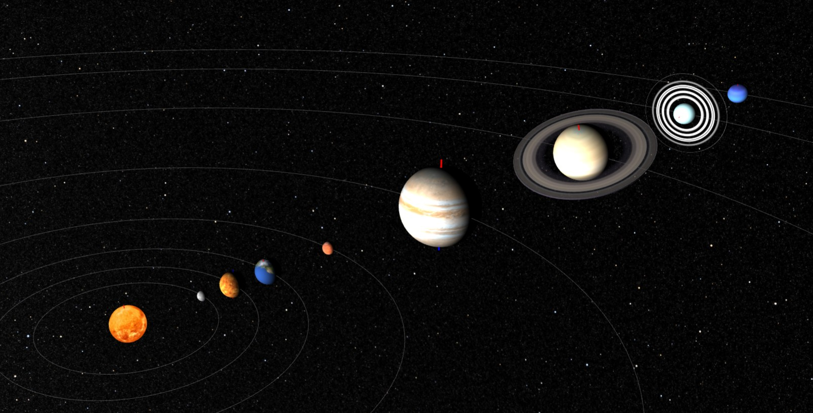
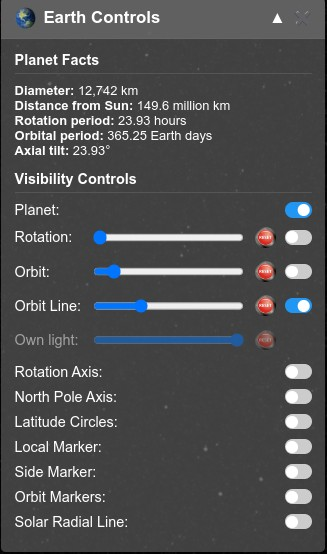
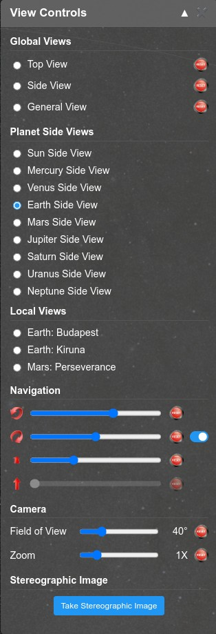

# Solar System Model

An interactive 3D solar system model built with Three.js that allows users to explore the planets, their orbits, and various astronomical features.

## Features

- **Interactive 3D Solar System**: Navigate through a realistic model of our solar system
- **Multiple View Modes**: Global view, planet side views, and local views
- **Detailed Planet Controls**: Right-click on any planet to access detailed control panels
- **Realistic Planet Textures**: High-quality textures for all planets and celestial bodies
- **Orbit Visualization**: View and control planet orbits with adjustable speeds
- **Day/Night Effects**: Toggle realistic lighting effects on planets
- **Rotation Controls**: Adjust planet rotation speeds and axes
- **Scale Options**: View the solar system in different scale modes (no-scale, size-scale, distance-scale, full-scale)
- **Stereographic Image Export**: Create 3D stereographic images for use with VR viewers

## Controls

- **Left Mouse Button**: Rotate the camera view
- **Middle Mouse Button/Scroll**: Zoom in and out
- **Right Mouse Button (Click)**: Open planet control panel when clicking on a planet
- **Right Mouse Button (Drag)**: Pan the camera view

## Planet Control Panels

Right-click on any planet to open its control panel, which provides options for:

- Toggling planet visibility
- Adjusting rotation and orbit speeds
- Showing/hiding orbit lines
- Displaying latitude circles and axis lines
- Viewing planet facts and data

## View Controls

The View Control Panel allows you to switch between different perspectives:

- **Global Views**: Top view, general view, side view
- **Planet Side Views**: View from the side of any planet
- **Local Views**: View from the surface of planets

## System Requirements

- Modern web browser with WebGL support
- Recommended: Dedicated graphics card for smoother performance with full-scale mode

## Technologies Used

- **Three.js**: 3D rendering library
- **JavaScript**: Core programming language
- **HTML5/CSS3**: Structure and styling

## Credits

- Planet textures: [Solar System Scope](https://www.solarsystemscope.com/textures/)
- Sky textures: [NASA Scientific Visualization Studio](https://svs.gsfc.nasa.gov/4851/)

## License

This project is open source and available under the MIT License.
